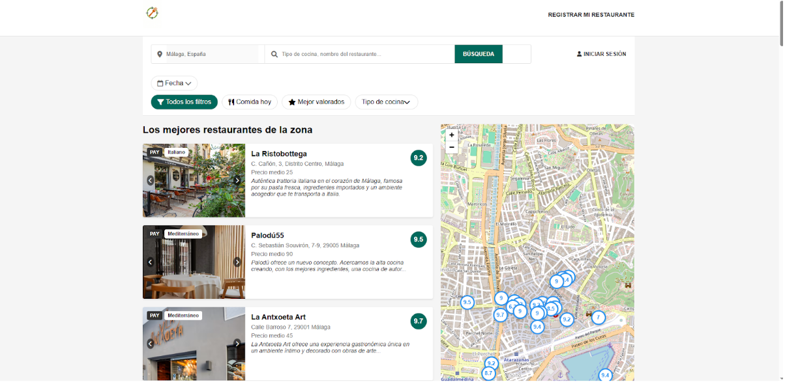

# FoodCompass

[Leer en inglés](README.md)

> Proyecto personal:

FoodCompass es una aplicación web que recomienda restaurantes según las preferencias del usuario.  
Su objetivo principal es ayudar a los usuarios a descubrir experiencias gastronómicas personalizadas de manera sencilla.

## Funcionalidades
- Recomendaciones de restaurantes basadas en preferencias.
- Filtrado por categoría, rango de precio y valoración.
- Búsqueda y filtrado de restaurantes.
- Integración con Leaflet para mostrar la ubicación de los restaurantes.

## Tecnologías
### Backend
- PHP
- MySQL
### Frontend
- HTML
- CSS
- JavaScript
### API
- Leaflet
- Google reCAPTCHA

## Instalación
1. Clona este repositorio:

```bash
git clone https://github.com/iOteizaa/FoodCompass.git
```
2. Importa la base de datos (/sql):

- Ejecuta `sql/script.sql` para crear las tablas.

- Ejecuta `sql/data.sql` para insertar datos de ejemplo (opcional).

3. Configura la conexión a la base de datos `(/util/conexion.php)`.

4. Configura las claves de API:

- Añade tu site key y secret key de Google reCAPTCHA.

5. Configura los tokens de autenticación para las sesiones de usuario en los siguientes archivos de la carpeta `/public/usuario/`:

- iniciosesion.php

- checklogin.php

- cerrarsesion.php

6. Inicia un servidor local (XAMPP) y accede al proyecto.

## Uso

1. Abre tu navegador y ve a `http://localhost/FoodCompass`.

2. Explora la lista de restaurantes o utiliza la barra de búsqueda para encontrar un restaurante específico.

3. Filtra los restaurantes por:

- Tipo de cocina.

- Fecha y hora disponibles.

- Precio

4. Haz clic en una tarjeta de restaurante para ver información detallada:

- Imágenes del restaurante.

- Descripción y precio.

- Valoraciones y reseñas.

5. Si estás registrado e inicias sesión, puedes:

- Acceder a tu perfil personal.

- Reservar mesa.

- Valorar y dejar reseñas.

6. Interactúa con el mapa para ver la ubicación de los restaurantes.

## Demo
### Página de Inicio

[](public/img/index.png)
Captura de pantalla de la página de inicio mostrando restaurantes destacados, la barra de búsqueda y los filtros.

### Página de Restaurantes

[](public/img/restaurante.png)
Captura de pantalla de la página de restaurantes.