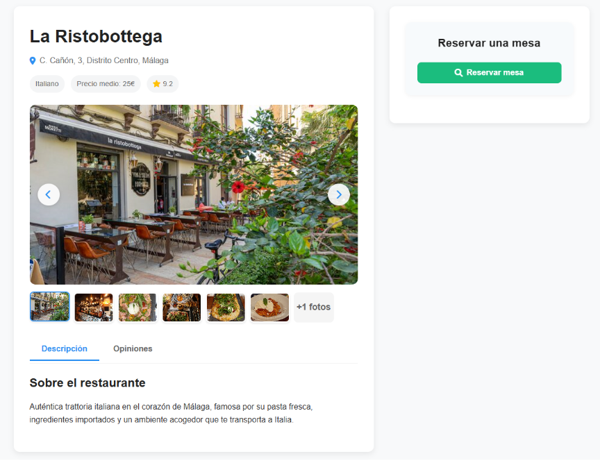

# FoodCompass

[Leer en inglés](README.md)

> Proyecto personal:

FoodCompass es una aplicación web que recomienda restaurantes según las preferencias del usuario.  
Su objetivo principal es ayudar a los usuarios a descubrir experiencias gastronómicas personalizadas de manera sencilla.

## Funcionalidades
- Recomendaciones de restaurantes basadas en preferencias.
- Filtrado por categoría, rango de precio y valoración.
- Búsqueda y filtrado de restaurantes.
- Integración con Leaflet para mostrar la ubicación de los restaurantes.

## Tecnologías
### Backend
- PHP
- MySQL
### Frontend
- HTML
- CSS
- JavaScript
### API
- Leaflet
- Google reCAPTCHA

## Demo
### Página de Inicio

Captura de pantalla de la página de inicio mostrando restaurantes destacados, la barra de búsqueda y los filtros.

### Página de Restaurantes

Captura de pantalla de la página de restaurantes.
