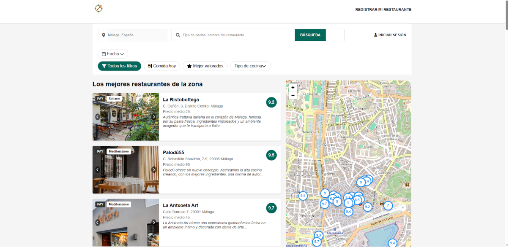
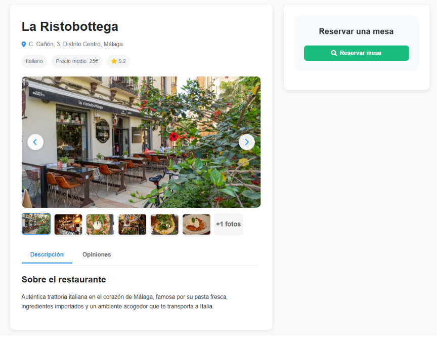

# FoodCompass

[Leer en español](README.es.md)

> Personal project:

FootballDesk is a web application that recommends restaurants based on user preferences.  
Its main goal is to help users discover personalized dining experiences easily.

## Features
- Restaurant recommendations based on preferences.
- Category, price range and rating.
- Search and filter restaurants.
- Integration with Leaflet to show restaurant locations.

## Tech Stack
### Backend
- PHP
- MySQL
### Frontend
- HTML
- CSS
- JavaScript
### API
- Leaflet
- Google reCAPTCHA

## Installation
1. Clone this repository:

```bash
git clone https://github.com/iOteizaa/FoodCompass.git
```

2. Import the database (/sql):
- Run `sql/script.sql` to create tables.
- Run `sql/data.sql` to insert sample data (optional).
  
3. Configure the database connection (/util/conexion.php).

4. Configure API keys:
- Add your Google reCAPTCHA (site key and secret key)

5. Configure authentication tokens for user sessions in the following files under the `usuario/` folder:
   - `iniciosesion.php`
   - `checklogin.php`
   - `cerrarsesion.php`

6. Start a local server (XAMPP) and access the project.

## Usage
1. Open your browser and go to `http://localhost/FoodCompass`.
2. Browse the list of restaurants or use the search bar to find specific ones.
3. Filter restaurants by cuisine type, date, or time using the available filters.
4. Click on a restaurant card to view detailed information, including images, description, average price, and reviews.
5. Once logged in, you can:
   - Access to a personal profile
   - Reserve a table at your chosen restaurant.
   - Rate and leave reviews for restaurants.
7. Interact with the map to see restaurant locations and highlight cards by hovering over markers.

## Demo
### Index Page
[](public/img/index.png)  
Screenshot of the homepage showing featured restaurants and search bar.

### Restaurants Page
[](public/img/restaurante.png)  
Screenshot of the restaurants page.
